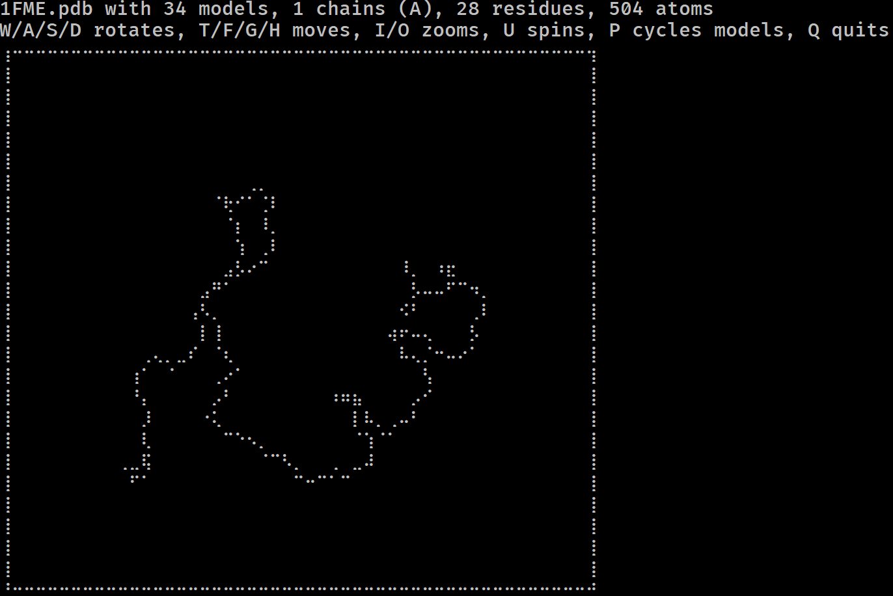

# mmterm

Have you ever wondered if you could visualise a protein in the terminal?
Do you miss the resolution of 1990s RasMol?
More seriously, have you ever wanted to get a feel for a protein/DNA/RNA structure on a remote system without having to copy it locally and load it in PyMol?

If so, mmterm is for you.
It gives you a quick interactive view of a PDB/mmCIF/MMTF file, purely in the terminal.
It should work anywhere that the Python curses module works, i.e. anywhere but Windows.
It is built on top of [drawille](https://github.com/asciimoo/drawille), [Biopython](https://github.com/biopython/biopython) and [NumPy](https://numpy.org).

## Installation

Python 3 is required.

```bash
git clone https://github.com/jgreener64/mmterm
cd mmterm
pip install -e .
```

## Usage

Installation puts the executable `mmterm` on the path.
Run `mmterm -h` to see the help text.
To view a structure, just give the filepath:

```bash
mmterm 1FME.pdb
```



Controls for rotating, translating, zooming, spinning and playing trajectories are given.
The file format is guessed from the file extension but can be given explicitly with `-f`:

```bash
mmterm 1FME -f mmcif
```

Other options:

```bash
# Show a different model initially
mmterm 1FME.pdb -m 5

# Only show given chains
mmterm 4KPY.pdb -c A B

# Decrease the size of the viewing box
mmterm 1FME.pdb -s 50
```

You can also use mmterm to view proteins from within other Python scripts:

```python
from mmterm import view_protein
view_protein("1FME.pdb")
```
